# Custom Security Layer (CSL)

This is a TLS-inspired protocol over raw TCP sockets implemented in C.

**Current Status :**

- [x] Level 1 done
- [x] Level 2 done
- [x] Level 3 done


## Build and run

**Disclaimer:Make sure to be in the project root before running these commands**

### Build commands

- Create a build directory in the project root dir
- Configure the project and generate build file using the below cmd

```bash
cmake -S . -B build
```

- Build the project using the below cmd

```bash
cmake --build build
```

- Build the project with the debug flag

```bash
cmake -S . -B build -DCSL_DEBUG=ON
cmake --build build
### to disable debug run the same cmd but replace ON with OFF
```

- Build the projects for testing

```bash
cmake -S . -B build -DBUILD_TESTS=ON
cmake --build build
### to disable debug run the same cmd but replace ON with OFF
```

### Run commands

- Running the server

```bash
./build/server
```

- Running the client

```bash
./build/client
```

- Running the tests

```bash
./build/test_frame
./build/test_dh
```

## Project structure

Table of files and the one job each has (net, io, frame, config, server, client, test_frame).

| File       | Job                                                                             |
| ---------- | ------------------------------------------------------------------------------- |
| server     | the main tcp server connecting to the client                                    |
| client     | client connecting to the tcp server                                             |
| net        | methods for tcp server/client                                                   |
| io         | methods for sending and recieving fixed length messages                         |
| frame      | methods for sending and recieving one frame,encoding and decoding of the header |
| dh         | DH parameters, keypair generation, public key and shared secret derivation      |
| handshake  | methods for exchanging public keys using HELLO frames and deriving secrets      |
| config     | constant values/parameters (DH 2048-bit prime, generator, port)                 |
| test_frame | unit tests for transmission of frames, encoding and decoding etc                |
| test_dh    | unit tests for DH prime, key generation, bounds and random distribution         |
| kdf | key derivation functions |

## Level 1: framing

- **Frame format diagram:**

```markdown
| type (1 byte) | length (4 , big-endian) | payload (length) |
```

- Message types table (HELLO, FINISHED, DATA, ALERT, CLOSE) and what each is for

| Type     | Hex  | Usecase                                                                                                      |
| -------- | ---- | ------------------------------------------------------------------------------------------------------------ |
| HELLO    | 0x01 | Exchanging public keys                                                                                       |
| FINISHED | 0x02 | Successfully connected to the client                                                                         |
| DATA     | 0x03 | Messages                                                                                                     |
| ALERT    | 0x04 | Alert messages in case any tampering while transmission after encrypting with the MAC key or any other error |
| CLOSE    | 0x05 | Closing the connection                                                                                       |

- A worked byte example

```markdown
### message = |DATA|1byte|A|

### in bytes = 03 00 00 00 01 41
```

- The layering: io (exact N bytes) -> frame (header + payload) -> everything above

## Level 2: Diffie-Hellman key exchange handshake flow

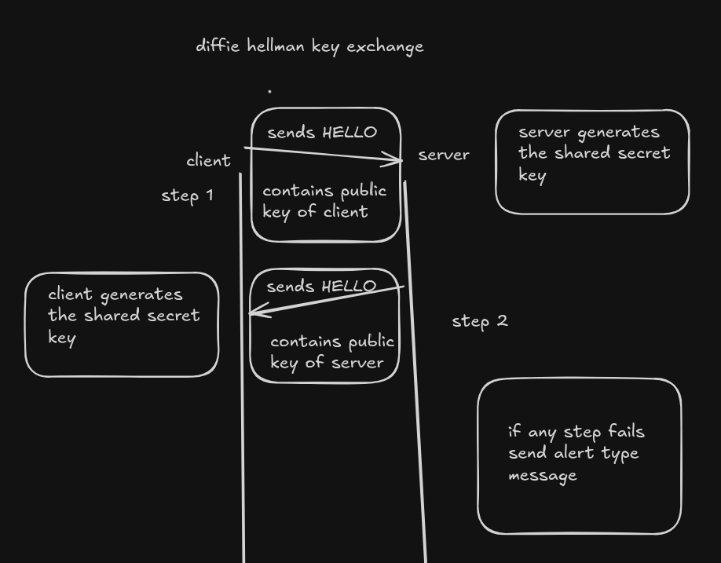

- Both sides computed the same shared secret key

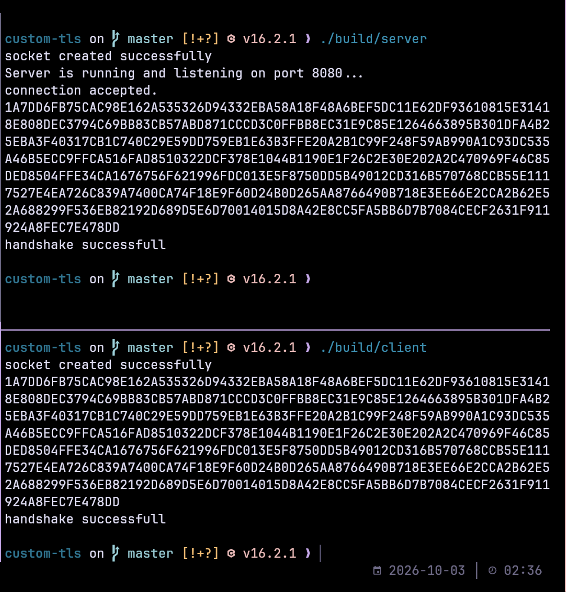

- I used openssl's BIGNUM for storing and operating on large-numbers of 2048 bit-length
- All keys are stored and processed as BIGNUM in the program
- All keys are converted back to bytes (byte array to be specific ) before sending it through the socket
- The conversion always returns a fixed size 256-byte array bcoz of padding added in BN_bn2binpad()
- **Wire format for public keys:**
  The public key is serialized from an OpenSSL BIGNUM into a big-endian binary byte array using BN_bn2binpad.
  Padded with leading zeros to guarantee exact DH_PUB_LEN (256 bytes = 2048 bits) regardless of value:

```txt
### HELLO Frame = |type (1B = 0x01)|len (4B = 0x00000100 = 256)|payload (256 bytes public key)|
```

## Level 3: Key derivation

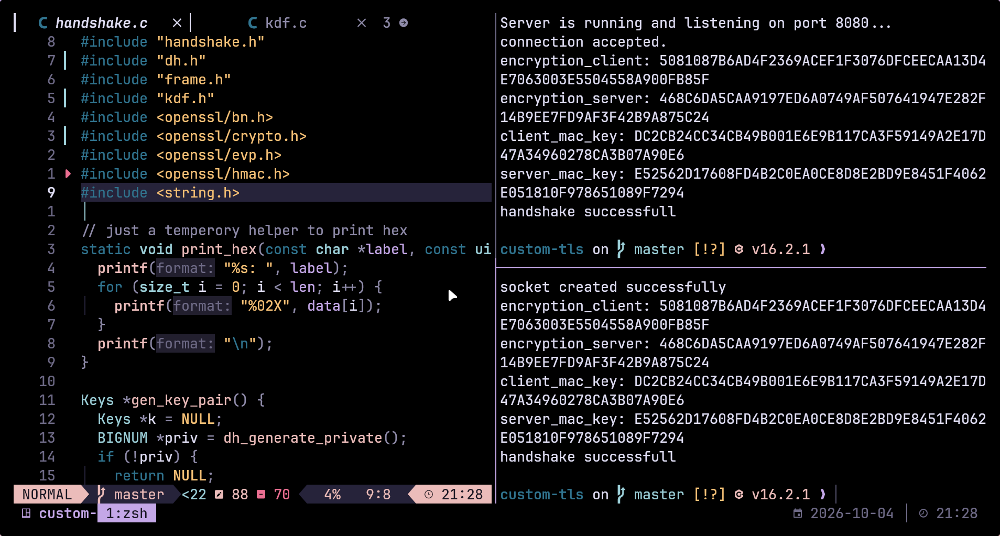

- Derived 4 keys using the shared secret key ,
   - encryption-key for server
   - encryption-key for client
   - mac-key for server
   - mac-key for client

- 2 encryption keys to prevent Reflection attacks
- 2 MAC for verification of handshake in both sides
- I have used HMAC for key extraction phase as well as key expansion phase of the key derivation.

## Design decisions

- **TCP needs framing:** it's a byte stream with no message boundaries, and a single recv can return part of a message or parts of two. That's why read_all and write_all exist.
- **The length is big-endian and how the shifts work:** the shifts operate on values, so they're portable, and endianness only matters where a number becomes bytes on the wire.
- **Capping the max payload size:** the length comes from the other side, so a bad peer could claim a huge memory and make me allocate it. I check it against MAX_PAYLOAD before calling malloc
- **1 Byte for each type of message**: Since the most necessary types are so few, we can represent each of them with just 1 byte which saves the memory overhead
- **separate layer for transmission of frames**:It would make it easier to integrate the encryption of frame payload later
- **No two-way message exchange yet**:It would take much time to implement right now, also read about different approaches to achieve it like polling,forking/multi-threading,event-loop etc but too complicated for now. Keeping it for Level 6.
- **Chose MODP Group 14 (RFC 3526):** it's a published safe prime in the RFC
- **Key validation:** Simple checks for validation of private and public keys that AI told me where sufficient,but my core idea was before I operate on the keys I should know if it is a valid key or not , just like before dereferencing a pointer I should check if it is a nullptr.
- **Fixed 256-byte wire length (DH_PUB_LEN):** Raw BN_num_bytes can return 255 bytes if the most significant byte is 0x00. Using BN_bn2binpad pads with leading zeros so the wire format is always deterministic and fixed-length.
- **HMAC for key derivation:** Using HMAC for key derivation is a standard practice in cryptography. It is a pseudorandom function that is used to derive keys from a shared secret key. 
- I did not use standard HKDF function from `openssl` as it had lot of boilerplate code and I did not have time to understand it and use it
- I have used HMAC-SHA-256 instead of just SHA-256 as we also need to be able to encrypt/decrypt the messages if we know the key which plain SHA-256 does not provide it only does hashing  

## Testing

( **Disclaimer :** I have heavily used AI for testing section )

### Unit tests (`test_frame.c test_dh.c`)

- **Sanitizers:** the test target is compiled with AddressSanitizer and UBSan, so memory leaks, out-of-bounds access, and undefined behaviour (like the missing `(uint32_t)` cast in `decode_header`) crash the test instead of passing silently.
- **Reading the result:** every test prints `<name>: ok`. A failed `assert` aborts the program (exit status 134), so I check `echo $?` is `0` after the run.

| Test                         | What it checks                                                                                                                                                         |
| ---------------------------- | ---------------------------------------------------------------------------------------------------------------------------------------------------------------------- |
| header                       | `encode_header` converts the given length into big_endian using bitwise operations , checks exact `03 00 00 01 02` for (type 3, len 258),similarly for `decode_header` |
| slow writer                  | `read_all` still returns all 5 bytes when the peer sends 1 byte every 50 ms                                                                                            |
| oversize                     | a header claiming `MAX_PAYLOAD + 1` is rejected by `recv_frame`                                                                                                        |
| huge length                  | a header claiming 4 GB (`0xFFFFFFFF`) is rejected without trying to allocate it                                                                                        |
| truncated payload            | header says 100 bytes, only 10 arrive and then EOF -> `recv_frame` fails and nothing leaks                                                                             |
| empty payload                | a frame with `len = 0` (CLOSE) arrives with `payload == NULL` and the right type                                                                                       |
| back to back                 | 3 frames (1, 1000 and 0 bytes) written before any read still come out separately and in order                                                                          |
| write to closed peer         | `write_all` returns -1 and the process is not killed by SIGPIPE                                                                                                        |
| eof mid read                 | `read_all` returns -1 instead of hanging when the peer closes early                                                                                                    |
| zero bytes                   | `read_all` / `write_all` with 0 bytes succeed                                                                                                                          |
| send_frame rejects bad input | `send_frame` refuses a payload bigger than `MAX_PAYLOAD`                                                                                                               |
| max size frame               | a full `MAX_PAYLOAD` (1 MB) frame goes through, the data is checked byte by byte and so is the child's exit status                                                     |
| fragmented frame             | a whole frame (header + payload) arriving 1 byte at a time is reassembled                                                                                              |
| closed before/inside header  | `recv_frame` fails when 0 bytes or only 3 of the 5 header bytes arrive                                                                                                 |
| test_p_bits                  | Verifies the prime modulus p is exactly 2048 bits.                                                                                                                     |
| test_p_prime                 | Verifies p is prime using OpenSSL's Miller-Rabin test.                                                                                                                 |
| test_p_safe_prime            | Verifies `q = (p - 1) / 2` is also prime (safe prime condition).                                                                                                       |
| test_priv_in_range           | Generates 100 private keys and checks 2 ≤ priv ≤ p - 2.                                                                                                                |
| test_priv_distinct           | Verifies generated private keys are mutually distinct.                                                                                                                 |
| test_priv_top_bit            | Checks that ~50% of generated keys utilize all 2048 bits (uniform distribution).                                                                                       |
| test_priv_boundaries_small_p | Tests range edge-cases (p = 23, values 2..21) and clean failure on invalid small p.                                                                                    |
| priv_before_init             | Confirms dh_generate_private safely fails before dh_init and succeeds after                                                                                            |

### Mutation checks

A test that has never failed hasn't proved it can catch anything (first time me doing this bcoz AI told but got to know a new thing), so these checks basically break the code on purpose, one change at a time, and check if we get a result we would expect or something behaves differently

| Deliberate bug                                             | Caught by                                     | Result                                                                                                         |
| ---------------------------------------------------------- | --------------------------------------------- | -------------------------------------------------------------------------------------------------------------- |
| `encode_header` writes the length bytes in the wrong order | header                                        | assert failed                                                                                                  |
| `read_all` doesn't advance the buffer pointer              | slow writer, fragmented frame, max size frame | assert failed                                                                                                  |
| `write_all` doesn't advance the buffer pointer             | nothing                                       | survived: a blocking `send` normally writes everything in one call, so the partial-write path is never reached |
| `recv_frame` allocates before checking `len > MAX_PAYLOAD` | oversize hangs, huge length is caught by ASan | hang / ASan abort                                                                                              |
| `decode_header` without the `(uint32_t)` cast              | header                                        | UBSan: left shift overflows `int`                                                                              |
| `recv_frame` forgets to `free` on a failed payload read    | truncated payload                             | LeakSanitizer report at exit                                                                                   |

### End-to-end (real TCP)

- **Multi-frame client:** one connection, the server stays up. For each frame the client sends it, reads the echo and compares type, length and bytes. Frames used: a short text (`HELLO`, 5 bytes), 100 KB of a repeating pattern (`DATA`, bigger than a single `recv`), binary with `0x00` and `0xFF` inside (`ALERT`), and an empty `CLOSE` which makes the server stop.

```bash
type=1 len=5: PASS
type=3 len=102400: PASS
type=4 len=4: PASS
type=5 len=0: PASS
```

- **Independent check with `nc`:** `nc` doesn't use my encoder, so this confirms the wire format matches the spec and not just my own client. I sent the bytes by hand:

```bash
printf '\x03\x00\x00\x00\x05hello' | nc 127.0.0.1 8080
```

The server printed `type=3 len=5` and echoed the frame back.

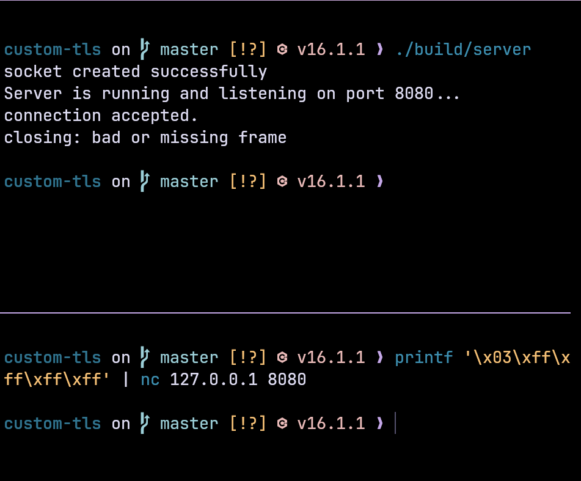
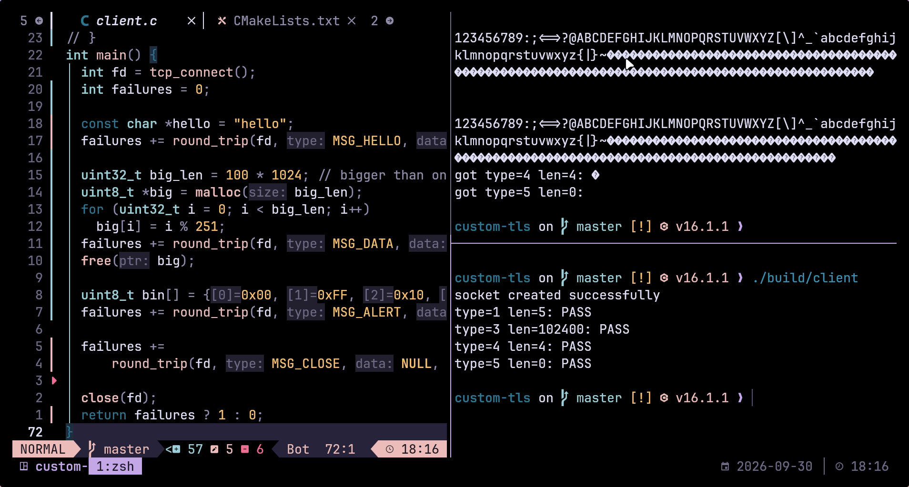
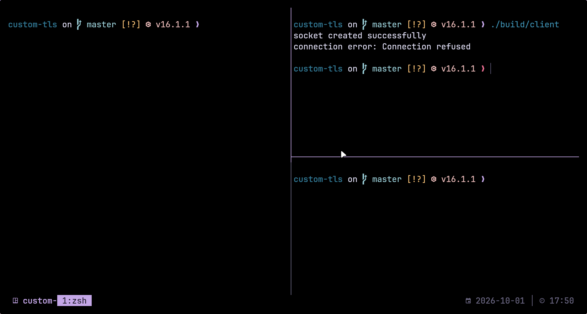
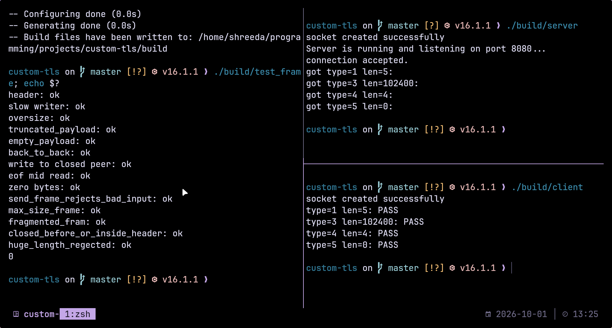
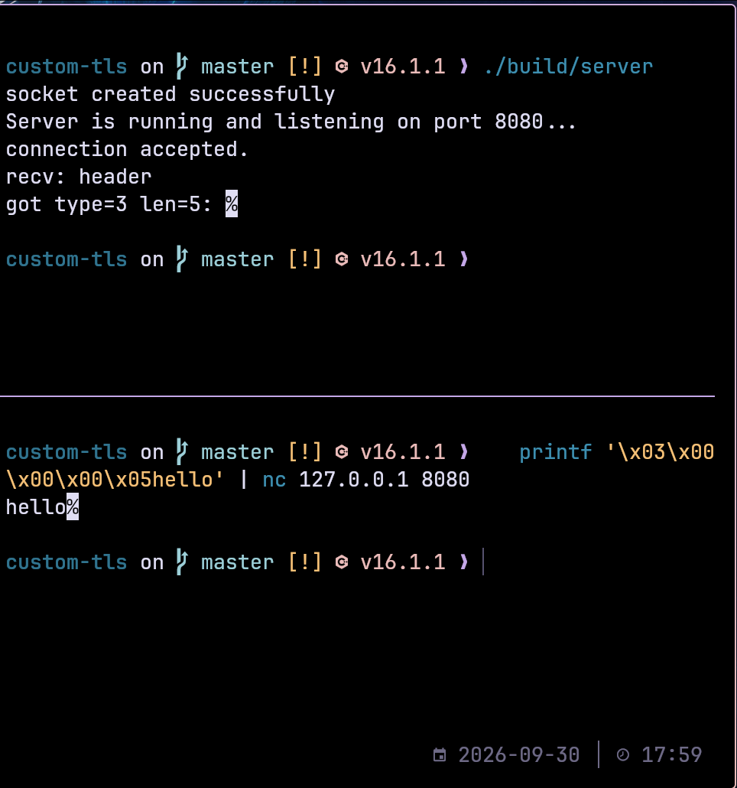
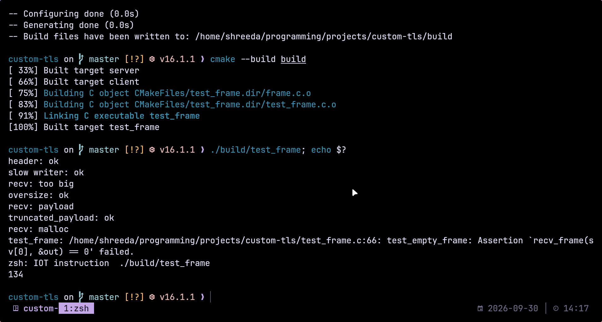
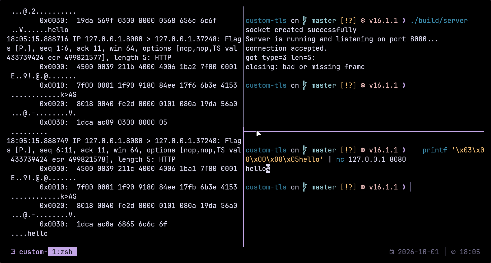
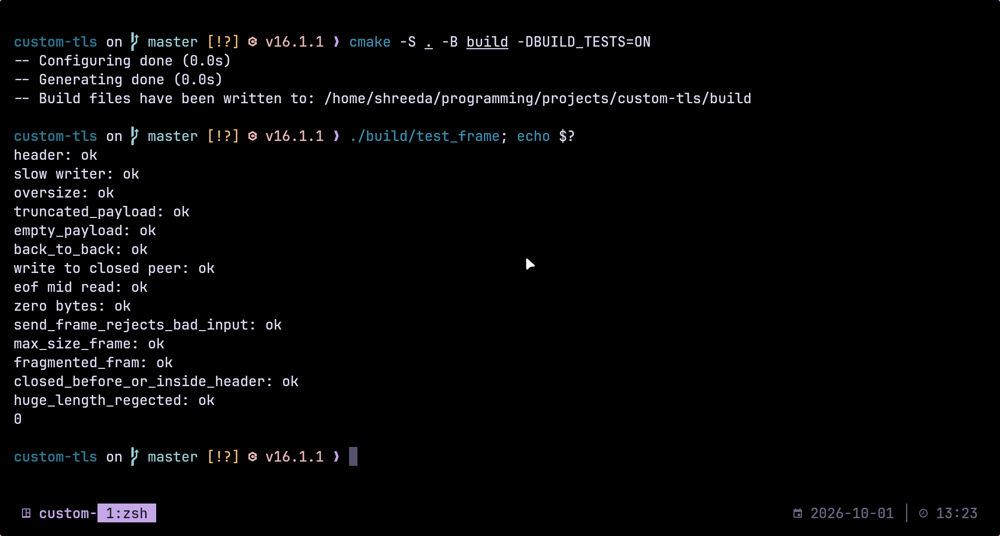

## Setbacks and debugging

- **The `n == 0` bug in my first client/server loops:** I used `if (n == 0)` after `send` to switch from sending to receiving. But `recv` returns 0 only when the peer closes (EOF), while `send` returns how many bytes it queued and never 0 for a non-empty message. So the client's `ok` flag never flipped: it kept sending the same message forever and never reached `recv`, and the server waited in `recv` for an EOF that never came. I dropped the flag-based loop and use a fixed request/response order built on frames.

- **`read_all` / `write_all` bugs:** I passed `rbuf` to every `recv` call instead of `rbuf + bytes_read`, so a partial read would overwrite the start of the buffer. The same loop also added `-1` (error) to the byte count and returned an error on `EINTR` instead of retrying. Fixed by advancing the pointer, checking `n < 0` before touching the count, and retrying on `EINTR`. The slow-writer test (1 byte every 50 ms) proves the loop works.

- **`Frame *out;` pointing nowhere:** I declared pointers and wrote through them (`out->payload = NULL`) without ever creating a `Frame`. I made the same mistake in `recv_frame` with `uint8_t *type; uint32_t *len;` passed to `decode_header`. Fix: plain variables on the stack, passing their addresses with `&`.

- **Size check on the wrong variable:** `recv_frame` checked `out->len > MAX_PAYLOAD`, which is leftover garbage from before the call, instead of the length just decoded from the header. That would have made the cap useless.

- **Empty-payload bug in `recv_frame` (fixed):** `test_empty_frame` and `test_back_to_back` failed with an assertion (exit status 134 = SIGABRT from `assert`), and my debug print `recv: malloc` appeared right before it. A frame with `len == 0` has nothing to allocate, so `payload` is legitimately `NULL`, but my `payload == NULL -> return -1` check treated that as "malloc failed". `NULL` meant both "empty" and "allocation failed". Fix: only allocate and check when `len > 0`, and always fill `out` before returning 0.

- **Confusing `nc` output:** `recv: header` printed before `got type=3 len=5:`. The `got ...` line had no newline, so stdout (line-buffered on a terminal) held it until exit while stderr printed immediately. The `%` after it is just zsh marking a line with no trailing newline.

- **1-byte stack buffer overflow in `gen_hello_msg`:** I declared `uint8_t payload;` (1 byte) on the stack, and `BN_bn2binpad` overflowed it when writing 256 bytes. Fix: allocate 256 bytes on the heap with `malloc(DH_PUB_LEN)`.

- **OpenSSL `BIGNUM` vs standard `free()`:** I called `free(priv)` instead of `BN_clear_free(priv)`. Standard `free()` only releases the outer struct, which leaks the internal limb buffer and leaves secret material in memory. Fix: use `BN_clear_free` for private keys and `BN_free` for public keys.

- **Server-side public key validation gap:** At first only the client validated the server's public key, and the server called `dh_generate_shared()` straight away on unvalidated client input. Fix: added the same `valid_pub_key(ret)` check to `do_handshake_server()`, so validation is symmetric.

- **Missing `return` on socket errors:** If `recv_frame()` returned -1, execution continued past the error check and dereferenced an unpopulated frame. Fix: added an explicit `return -1;` on all failure branches.

- **Memory leak in multiple places** like if a frame is not recieved or if key if the shared key generation fails the memory was not getting freed in those cases 

- **Not cleansing the stack** when exiting or returning on error, used `OPENSSL_cleanse()` for cleansing and then `OPENSSL_clear_free()` for freeing the memory

## Known limitations / next steps

**Limitations (Level 1)**

- **Nothing is encrypted or authenticated yet:** frames travel in plaintext, so anyone on the path can read or modify them. That is what Levels 2 to 5 add.
- **One client, one connection, strict turn-taking:** the server handles a single client and exits when it's done, and each side sends then waits for a reply. Simultaneous send/receive (`poll`) is planned for Level 6.
- **No timeouts:** a peer that sends a header and then stalls blocks `read_all` forever. A receive timeout (`SO_RCVTIMEO`) would fix it.
- **Address and port are hardcoded** (`127.0.0.1:8080`), so it only works on one machine for now. Level 6 asks for separate machines, so I'll make them command-line arguments.
- **`recv_frame` can't tell a clean disconnect from a failure:** both return -1. A graceful shutdown is signalled with a `CLOSE` frame instead.
- **Unknown message types pass through `recv_frame`:** the framing layer only moves bytes, so rejecting unexpected types is left to the handshake and chat layers.
- **The `write_all` partial-write path isn't covered by a test** (the "no pointer advance" mutation survived): a blocking `send` normally writes everything in one call, so that branch is hard to trigger.
- **Linux only:** the tests use `fork` and `socketpair`, and the code uses `MSG_NOSIGNAL`, which isn't available on every OS.


**Limitations (Level 2)**

- **Raw shared secret used directly:** The 2048-bit BIGNUM shared secret cannot be directly plugged into symmetric ciphers (AES expects 128/256-bit keys).
- **Vulnerable to active Man-in-the-Middle (MITM):** The public keys travel in plaintext with no signature or certificate, so an active attacker could intercept and substitute their own public keys. Handshake confirmation (Level 4) detects tampering and identity keys (Level 8) prevents impersonation.

**Limitations (Level 3)**

- **NO production level key derivation is used deriving the keys:** I use my own way HKDF inspired way to derive the keys . Only one block used in the key-expansion phase.
- **I am printing keys in the log:** which is not a good practice for security.
- **I am freeing the public keys before generating the transcript for the MAC tag bits**: this works for now but will have to fix it later

**Next steps**

- Level 4: Confirm Handshake success/failure using transcript
- Level 5 design note: the frame header (type + length) has to stay in plaintext because `recv_frame` reads it before anything can be decrypted. So the MAC will cover the header as well as the ciphertext (`seq || type || length || iv || ciphertext`). Otherwise an attacker could change a `DATA` frame's type to `CLOSE` or `ALERT` and the tag would still verify.

## Demos

[▶️ Watch Level 1 Demo](https://drive.google.com/file/d/1Kb9xT1hujZ1XPJt3FfBvtfFBpkin1HJh/view?usp=sharing)
[▶️ Watch Level 2 Demo](https://drive.google.com/file/d/1d6PWBhfg9uPqFjPny4FsMjNku7GWyXuz/view?usp=drive_link)
[▶️ Watch Level 3 Demo](https://drive.google.com/file/d/1Z48A76xxsMzrI7V3Wo7-plzflSdr8h6O/view?usp=drive_link)